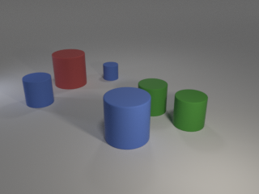

# Table of Contents

* [Introduction](#Introduction)
* [Usage](#Usage)
* [Tasks](#Tasks)
* [Results](#Results)
* [Conclusion](#Conclusion)

# Introduction

This repository is the result of my 2022 internship in <a href="https://www.lis-lab.fr/"> Laboratoire 
d'Informatique et Systèmes</a> conducted during the final year of my Bachelor in Computer Science.
I probed different Vision/Language transformer-based models in order to better understand the representations they produce and 
present here my results as well as how to reproduce them. 

I separate probing tasks in four categories :
- <ins>Global Tasks</ins> : They focus on a large portion of the input. For the probing model to perform well, the representations
need to contain details of the input as a whole.

- <ins>Local Tasks</ins> : They focus on a small portion of the input. For the probing model to perform well, the representations 
need to contain fine-grained details of the input.

- <ins>Hybrid Tasks</ins> : They focus on a large portion of the input but the representations produced need to contain fine-grained
details.

- <ins>Positional Tasks</ins> : The representations need to contain information about the position of certain parts of the input.

# Usage

python3 ./textual_tasks/topic_modeling.py --model MODEL [--nfold NFOLD] [--control] [--cpu] 

- MODEL is either 'clip', 'vilt', 'bert' or 'vit'
- NFOLD is the number of foldings for the kfold validation (default 10)
- --control flag is for shuffling labels during training
- --cpu flag is to use CPU instead of GPU

Some probing tasks have more arguments :

- '--rows ROWS' the number of rows for area classification grids
- '--cols COLS' the number of columns for area classification grids
- '[--coarse]' for part of speech tagging to use less specific classes
- '[--cls]' for word position to use classification instead of regression

# Tasks

Most of these tasks use the classification token produced by models' transformers, only Part Of Speech tagging uses the word 
representations. 

I modified <a href="https://cs.stanford.edu/people/jcjohns/clevr/">CLEVR</a>'s image generation algorithm 
to produce the images in the 'data/CLEVR' folder.

## Visual Tasks
### Intruder Binary Classification
In this task the model must predict whether there is an intruder in the image. There can be two types of intruder : either 
all other objects have the same color or all other objects have the same shape. 
 

 
In the left image, the blue sphere is the intruder as all other objects are red. In the right image, the green cylinder is 
the intruder as all other objects are spheres.
  

 
In the left image, all objects are red and in the right image all objects are cylinders, there is therefore no intruder.

It is a Global Task because all objects must be analyzed in order to complete it. The dataset is composed of 2000 images with
intruder and 2000 images without one.

### Intruder Type Classification
This task uses the 2000 images with intruder in order to train models to predict the shape and color of the intruder.
There is 3 shapes and 3 colors possible which makes 9 classes. 

At least 3 objects must be examined in order to determine which one is
the intruder and detailed features must be encoded to evaluate its color and shape, it is therefore a Hybrid Task.

### Intruder Bounding Box Regression
With the dataset of 2000 images containing an intruder the model must predict the bottom-left-most and top-right-most 
corners of the intruder. It is a Positional Task.

### Intruder Area Classification
With the dataset of 2000 images containing an intruder the model must predict in which part of the image the intruder is
in a 2x2, 3x3 or 5x5 grid. It is a Positional Task.

### Object Binary Classification
In this task the model must predict whether there is a small red cube in the image. For the probing model to perform well, the
representation must contain information about a single small object, it is therefore a Local Task.

 
Left : example without any red cube, Right : example with a red cube

The dataset for this task is composed of 2000 images with a red cube and 2000 images without any.

### Object Bounding Box Regression
With the dataset of 2000 images containing a red cube the model must predict the bottom-left-most and top-right-most corners of the red cube. It is a Positional Task.

### Intruder Area Classification
With the dataset of 2000 images containing a red cube the model must predict in which part of the image the red cube is
in a 2x2, 3x3 or 5x5 grid. It is a Positional Task.

### Fine-Grained Classification
The dataset used for this task is the <a href="https://www.robots.ox.ac.uk/~vgg/data/flowers/102/">102 Category Flower Dataset</a>.
The images have large scale, pose and light variations. In addition, there are categories that have large variations within the category and several very similar categories.

In order to complete this task the representations need to contain information about the whole flower as well as details of it
to classify similar categories. It is therefore a Hybrid Task.

## Textual Tasks

### Topic Modeling
In this task the model must predict the category of news headlines. For the probing model to perform 
well the representations must contain the meaning of the whole headline, it is therefore a Global Task.

The dataset used for this task is a subpart of the <a href="https://www.kaggle.com/datasets/rmisra/news-category-dataset?resource=download">News Category Dataset</a>.
I reduced the number of categories to 11 in order to increase the contrast between them. 

### Part Of Speech Tagging
In this task we associate each word of each sentence to its Part Of Speech tag, which has been predicted by <a href="https://spacy.io/models/en#en_core_web_sm">SpaCy's en_core_web_sm</a> model.
For this task only, the token used for probing is not the classification token but the word's representation. As we use only the word representation to predict the word's POS,
it is therefore a Local Task.

The dataset used for this task is a subpart of the <a href="https://paperswithcode.com/dataset/flickr30k">Flickr 30k dataset</a> containing 3000 sentences.

### Bigram Shift
In this task the model must predict whether two following words have been swapped in a sentence. 

*ex : "People at relaxing the park ." instead of "People relaxing at the park ."*

Although the shift is a local phenomenon, it can also alter the global meaning of the sentence and is therefore a Hybrid Task.

The dataset used for this task is the same subset of Flickr 30k as for the POS Tagging.

### Word Position
In this task the model must predict the position of the word "black" in each sentence based on the classification token representation.
It is a Positional Task.

The dataset used for this task is composed of 9000 descriptions from the Flickr 30k dataset, all containing the word "black" only once.

# Results

__Control__ is the result obtained when specifying the [--control] flag, it shuffles the labels during probing models' training
in order to estimate how a model trained on representations not containing useful information for the probing task would perform.

## Visual Tasks
 

| Global Task                     |   CLIP    | ViLT  |  ViT  | Control |
|:--------------------------------|:---------:|:-----:|:-----:|:-------:|
| Intruder Binary Classification  | __95.73__ | 82.40 | 86.24 |  53.67  |

 

| Local Task                   |   CLIP    | ViLT  |    ViT    | Control |
|:-----------------------------|:---------:|:-----:|:---------:|:-------:|
| Object Binary Classification | __87.88__ | 73.17 |   72.28   |  49.54  |

 

| Hybrid Task                  |   CLIP    | ViLT  |    ViT    | Control |
|:-----------------------------|:---------:|:-----:|:---------:|:-------:|
| Fine-Grained Classification  |   98.55   | 82.16 | __98.85__ |  0.59   |
| Intruder Type Classification | __58.42__ | 44.50 |   42.50   |  12.30  |

 

| Positional Task                    |   CLIP    |   ViLT    |  ViT  | Control |
|:-----------------------------------|:---------:|:---------:|:-----:|:-------:|
| Object Bounding Box Regression*    |   61.71   | __60.27__ | 61.02 |  68.21  |
| Intruder Bounding Box Regression*  | __59.58__ |   63.14   | 64.26 |  67.15  |
| Object Area Classification (2x2)   | __37.65__ |   32.50   | 36.34 |  26.52  |
| Object Area Classification (3x3)   |   33.83   | __33.95__ | 32.80 |  32.17  |
| Object Area Classification (5x5)   | __17.58__ |   16.45   | 17.12 |  14.35  |
| Intruder Area Classification (2x2) | __40.88__ |   34.12   | 35.73 |  30.43  |
| Intruder Area Classification (3x3) | __39.39__ |   30.45   | 31.22 |  29.43  |
| Intruder Area Classification (5x5) | __20.72__ |   17.33   | 17.82 |  15.77  |
* Mean Euclidian Distance in pixels (images are 320x240)
 
 

# Textual Tasks
 

| Global Task    |   CLIP    | ViLT  |   BERT    | Control |
|:---------------|:---------:|:-----:|:---------:|:-------:|
| Topic Modeling | __85.44__ | 64.03 |   67.35   |  14.77  |

 

| Local Task                              | CLIP  |   ViLT    | BERT  | Control |
|:----------------------------------------|:-----:|:---------:|:-----:|:-------:|
| Part Of Speech Tagging (coarse-grained) | 93.82 | __97.74__ | 97.17 |  27.72  |
| Part Of Speech Tagging (fine-grained)   | 92.46 | __97.22__ | 96.71 |  20.42  |

 

| Hybrid Task  | CLIP  | ViLT  |   BERT    | Control |
|:-------------|:-----:|:-----:|:---------:|:-------:|
| Bigram Shift | 72.83 | 73.25 | __83.88__ |  49.55  |

 

| Positional Task                 |   CLIP    | ViLT  | BERT  | Control |
|:--------------------------------|:---------:|:-----:|:-----:|:-------:|
| Word Position Classification    | __48.17__ | 39.39 | 35.28 |  21.87  |
| Word Position Regression (RMSE) | __2.44__  | 2.82  | 3.09  |  3.55   |

# Conclusion

On the vision level, CLIP seems to produce the best representations for all tested types of tasks. This is more likely due
to the quantity of images used for pretraining (around 100 times greater than for other models) than the contrastive pre-training itself.  
The comparison between the results of all three models and the control on positional tasks reveal that the classification token barely associate
the identified objects to their position in the image. Based on this evidence, we could expect these models to perform poorly 
on zero-shot classification when the position of items is important. It would be interesting to verify this hypothesis and compare
the performance with few-shot classification.

On the textual level, CLIP's representations seem to contain more information about the meaning of the sentence than other tested models
but fewer information on word level. This could be due to the contrastive pretraining used by CLIP which focuses on associating whole
sentences to images whereas other tested models use Masked Image Modeling, focusing therefore more on the words composing the sentence.
The positional tasks seem to reveal that the position of words is more important on textual level for classification but these
results must be complemented with further research as the only word used here is "black", usually an important adjective in sentences.
We could expect less information about the position of less important words such as some determinants to be encoded in representations.
